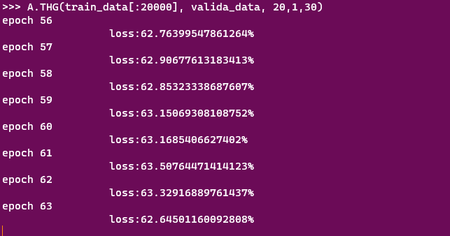

## Neural Network classify AES-256-GCM between chacha20poly1305

The experiment conculsion is the neural network model can't distinguish data from  AES-256-GCM or chacha20poly1305, and unmodified source.

After  some epoches, loss  rate wander around 63%. Total only three possibility.



### Steps replicate

- generate three form data: unmodified data, AES-256-GCM encryption data, chacha20poly1305 encryption data.
  
  `python3 main_generate_material.py`  

- feed module
  
  ```python
  import  read_train_material as ra
  train_data=rs.get('train')
  valida_data=ra.get('validate')
  import neural_network_cross_entropy as ne
  A=ne.nn([188,30,3])
  A.THG(train_data, valida_data, 20,1,30)
  ```
